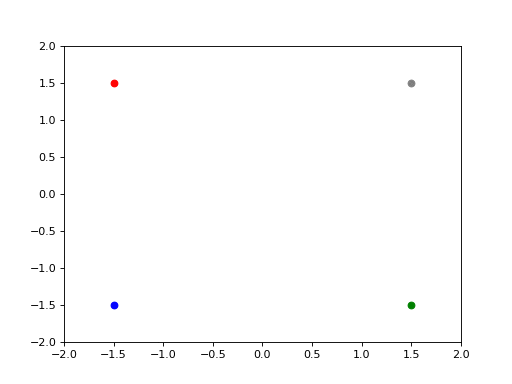

# Infinite horizon time LQR problem solved with Deep Learning and Dynamic Programming
See `lqr_infinite_horizon.ipnyb`

TODO: add entropy in the value function to add exploration. (We need to know the whole distribution!)

# Finite Horizon time Stochastic Control solved using Deep Learning
See `lqr.py`.

We solve the control problem, by minimising J

where g is convex. The policy alpha is parametrised with a neural network, and we use Method of successive approximations on Pontryagin Maximum principle. 
Algorithm:
1. Start with initial policy
2. Solve BSDE using Deep Learning for processes (Yt, Zt).
3. Update policy by maximising Hamiltonian (analog to Q-learning on model-free RL)
4. Go back to 2.

## TODO

Code is loopy. The bsde solver and the Hamiltonian should be vectorized across time. 

